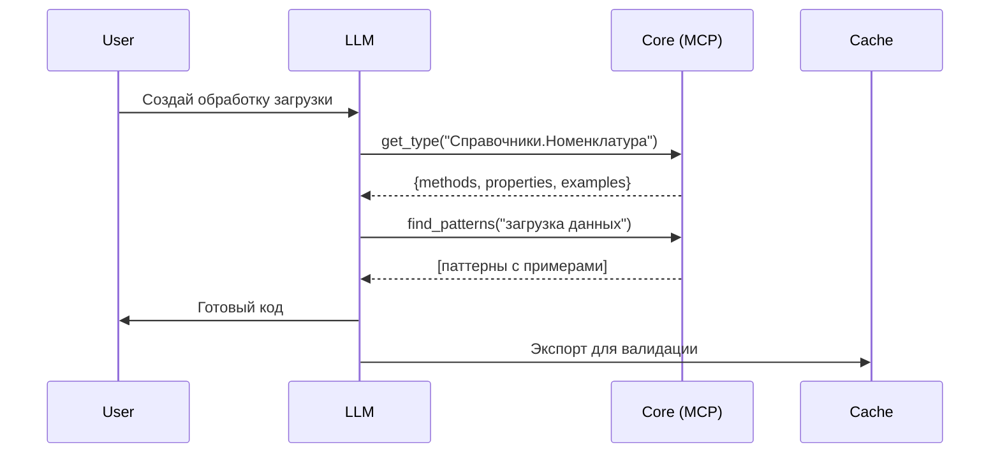
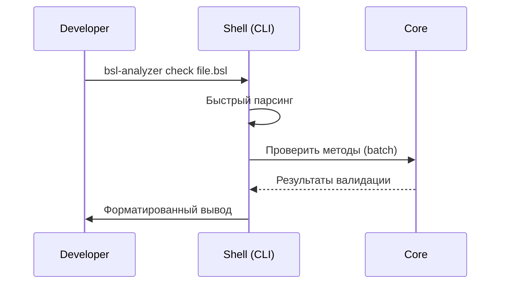
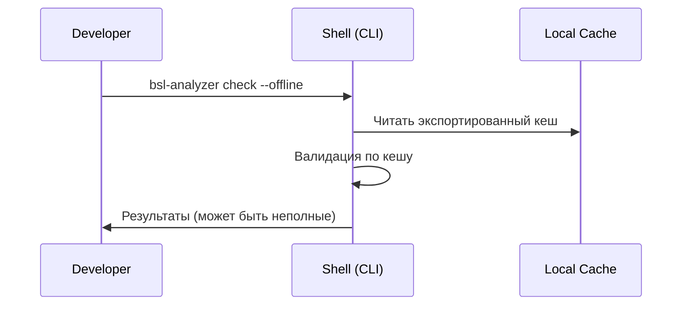

# BSL Type Safety Analyzer - Единая концепция

**Дата:** 2025-08-01  
**Версия:** 3.0 - Unified Concept  
**Статус:** Синтез LLM-first и Developer-friendly подходов

## Видение проекта

BSL Type Safety Analyzer - это **двухуровневая система**, обеспечивающая:
1. **Полный контекст для LLM** при генерации кода 1С
2. **Быструю валидацию для разработчиков** при контроле результатов

## Ключевая идея: Разделение Core и Shell

```
┌─────────────────────────────────────────────────────────┐
│                      BSL Analyzer                        │
├─────────────────────────┬───────────────────────────────┤
│      Core (Heavy)       │        Shell (Light)          │
├─────────────────────────┼───────────────────────────────┤
│  • UnifiedBslIndex      │  • CLI валидатор              │
│  • Полный граф типов    │  • Быстрые проверки           │
│  • MCP Server           │  • Минимальный footprint      │
│  • База знаний          │  • Human-friendly вывод       │
└─────────────────────────┴───────────────────────────────┘
```

## Архитектура: Best of Both Worlds

### 1. Core System (LLM-oriented)

**Назначение:** Обеспечить LLM полным контекстом

**Компоненты:**
```rust
pub struct BslAnalyzerCore {
    // Полный индекс - да, 500MB, но это OK для сервера
    unified_index: UnifiedBslIndex,
    
    // Семантические связи для понимания контекста
    semantic_graph: SemanticTypeGraph,
    
    // База паттернов и примеров
    knowledge_base: PatternKnowledgeBase,
    
    // Интерфейсы доступа
    mcp_server: Option<McpServer>,
    export_engine: CacheExportEngine,
}
```

**Характеристики:**
- Запускается как сервис/демон
- Загружает всё в память при старте
- Оптимизирован для throughput, не latency
- Предоставляет MCP API и экспорт кеша

### 2. Shell Tools (Developer-oriented)

**Назначение:** Быстрая валидация и feedback

**Компоненты:**
```rust
pub struct BslAnalyzerShell {
    // Минимальный парсер для валидации
    parser: TreeSitterBslParser,
    
    // Подключение к Core через IPC/HTTP
    core_client: CoreApiClient,
    
    // Локальный кеш частых запросов
    local_cache: CompactCache,
}
```

**Характеристики:**
- Старт < 50ms
- Память < 10MB
- Использует Core API для сложных проверок
- Может работать offline с ограниченной функциональностью

## Сценарии использования

### Сценарий 1: LLM генерирует код



### Сценарий 2: Разработчик проверяет результат



### Сценарий 3: Offline режим



## Реализация: Поэтапный план

### Фаза 1: Core Foundation (2 месяца)

1. **Сохранить UnifiedBslIndex** как есть
2. **Реализовать MCP Server** с базовыми инструментами
3. **Добавить CacheExportEngine** для экспорта в:
   - SQLite (структурированные запросы)
   - MessagePack (быстрая загрузка)
   - JSON (универсальность)

### Фаза 2: Shell Development (1 месяц)

1. **CLI валидатор** на tree-sitter
2. **Core API client** для обращения к Core
3. **Offline mode** с локальным кешем

### Фаза 3: Integration (2 недели)

1. **Docker compose** для развёртывания Core
2. **Installer** для Shell tools
3. **Документация** по интеграции

## Конфигурация системы

### Core configuration
```toml
[core]
mode = "server"
port = 7777
cache_dir = "~/.bsl_analyzer/core"

[index]
load_platform = true
load_config = true
memory_limit = "1GB"

[mcp]
enabled = true
auth = "token"

[export]
auto_export = true
formats = ["sqlite", "msgpack"]
```

### Shell configuration
```toml
[shell]
core_url = "http://localhost:7777"
cache_dir = "~/.bsl_analyzer/shell"
offline_fallback = true

[performance]
startup_timeout = "50ms"
memory_limit = "50MB"
```

## Метрики успеха

### Для LLM (Core)
- Полнота контекста: 100% типов доступны
- Latency MCP запроса: < 10ms
- Uptime: 99.9%

### Для разработчиков (Shell)
- Холодный старт: < 50ms
- Валидация файла: < 100ms  
- Точность offline: > 80%

### Общие
- Корректность генерации LLM: > 90%
- Удовлетворённость разработчиков: > 4.5/5

## Преимущества единой концепции

1. **Нет компромиссов** - каждый компонент оптимизирован под свою задачу
2. **Масштабируемость** - Core можно развернуть на мощном сервере
3. **Доступность** - Shell работает на любом компьютере
4. **Гибкость** - можно использовать только нужные части

## Развитие проекта

### Краткосрочные цели
1. Стабилизировать Core с текущей архитектурой
2. Создать минимальный Shell для валидации
3. Документировать API и форматы

### Долгосрочное видение
1. **Core as a Service** - облачная версия
2. **Плагины для IDE** на базе Shell
3. **Обучение LLM** на базе знаний

## Заключение

Единая концепция примиряет два противоречивых набора требований:
- **REQUIREMENTS_V2** (простота, скорость) → реализуется в Shell
- **ARCHITECTURE_REVIEW** (полнота, контекст) → реализуется в Core

Это позволяет создать систему, которая:
- Даёт LLM всю необходимую информацию для качественной генерации
- Не заставляет разработчиков ждать загрузки 500MB индекса
- Масштабируется от laptop до enterprise

**Ключевой принцип:** Разделяй и властвуй. Core для мощи, Shell для скорости.

---

*"Лучшее из двух миров" - не компромисс, а синергия.*