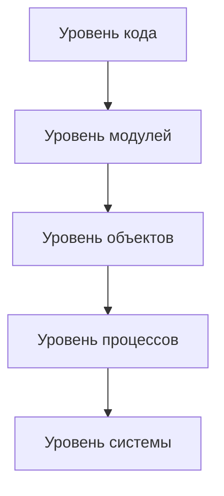
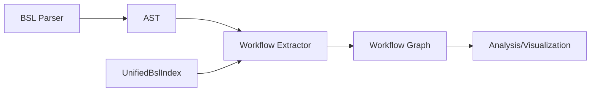
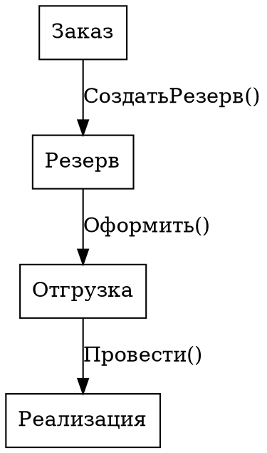
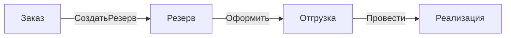
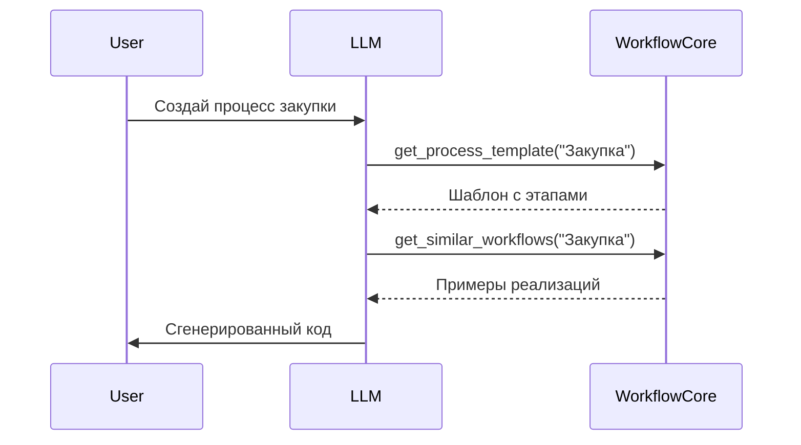
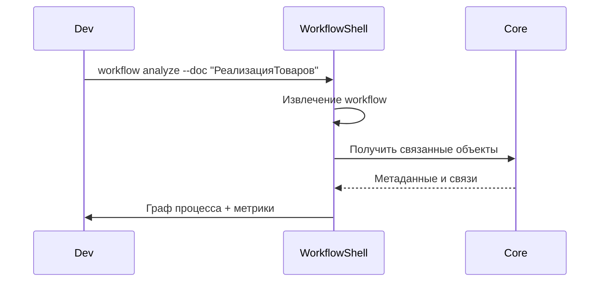

# Концепция Workflow Analyzer

**Версия:** 1.0  
**Дата:** 2025-01-07  
**Статус:** В разработке

## Определение Workflow в контексте 1С

### Что такое Workflow?

В контексте 1С:Предприятие под workflow понимается:

1. **Бизнес-процессы** - встроенные механизмы управления процессами
2. **Документооборот** - последовательности проведения документов
3. **Цепочки вызовов** - граф вызовов процедур и функций
4. **События и обработчики** - реакции системы на действия
5. **Состояния и переходы** - изменения статусов объектов

### Уровни анализа



## Архитектура решения

### Двухуровневая система

```rust
// Core - для LLM
pub struct WorkflowCore {
    knowledge_base: WorkflowKnowledgeBase,
    pattern_library: PatternLibrary,
    process_templates: ProcessTemplates,
    mcp_interface: McpWorkflowTools,
}

// Shell - для разработчиков
pub struct WorkflowShell {
    extractor: WorkflowExtractor,
    analyzer: WorkflowAnalyzer,
    visualizer: WorkflowVisualizer,
    reporter: WorkflowReporter,
}
```

### Интеграция с BSL Type Safety Analyzer



## Типы анализируемых workflow

### 1. Линейные процессы
```
Заказ → Резервирование → Отгрузка → Реализация → Оплата
```

### 2. Ветвящиеся процессы
```
         ┌→ Утверждение → Исполнение
Заявка →│
         └→ Отклонение → Архив
```

### 3. Циклические процессы
```
Планирование → Выполнение → Контроль
      ↑                          ↓
      └──── Корректировка ←──────┘
```

### 4. Событийные процессы
```
[Событие: Изменение остатков]
         ↓
[Обработчик: Пересчёт резервов]
         ↓
[Действие: Обновление регистров]
```

## Модель представления

### Граф workflow

```rust
pub struct WorkflowGraph {
    nodes: HashMap<NodeId, WorkflowNode>,
    edges: Vec<WorkflowEdge>,
    metadata: GraphMetadata,
}

pub enum WorkflowNode {
    // Узлы кода
    Procedure {
        module: String,
        name: String,
        params: Vec<Parameter>,
    },
    
    // Узлы данных
    Document {
        type_name: String,
        state: Option<DocumentState>,
    },
    
    // Узлы процессов
    BusinessProcess {
        name: String,
        stage: String,
    },
    
    // Узлы событий
    Event {
        object: String,
        event_type: EventType,
    },
    
    // Точки принятия решений
    Decision {
        condition: String,
        branches: Vec<Branch>,
    },
}

pub struct WorkflowEdge {
    from: NodeId,
    to: NodeId,
    edge_type: EdgeType,
    weight: f32, // Частота использования
    metadata: EdgeMetadata,
}

pub enum EdgeType {
    MethodCall,      // Прямой вызов метода
    DocumentFlow,    // Переход между документами
    EventTrigger,    // Срабатывание события
    StateTransition, // Изменение состояния
    DataFlow,        // Поток данных
    Control,         // Поток управления
}
```

## Методы анализа

### 1. Статический анализ кода

**Что анализируем:**
- Вызовы процедур и функций
- Обращения к объектам метаданных
- Изменения данных (записи, проведения)
- Условные переходы и циклы

**Как анализируем:**
```rust
impl WorkflowExtractor {
    pub fn extract_from_module(&self, module: &Module) -> WorkflowGraph {
        // 1. Парсинг AST модуля
        // 2. Извлечение вызовов
        // 3. Построение локального графа
        // 4. Связывание с глобальным графом
    }
}
```

### 2. Анализ метаданных

**Что анализируем:**
- Структуру конфигурации
- Связи между объектами
- Подписки на события
- Регламентные задания

**Источники данных:**
- Configuration.xml
- Файлы форм
- Модули объектов

### 3. Паттерн-анализ

**Типовые паттерны:**
- CRUD операции
- Документооборот
- Согласование
- Распределение
- Агрегация

**Антипаттерны:**
- Циклические зависимости
- Избыточные вызовы
- Нарушение инкапсуляции
- God-объекты

## Выходные форматы

### 1. Граф в DOT формате


### 2. Mermaid диаграммы


### 3. JSON для программной обработки
```json
{
  "workflow": {
    "name": "ПроцессПродажи",
    "nodes": [...],
    "edges": [...],
    "patterns": ["Документооборот", "Резервирование"]
  }
}
```

### 4. HTML отчёты
- Интерактивные графы (D3.js)
- Таблицы с метриками
- Рекомендации по оптимизации

## Метрики и KPI

### Метрики сложности
- **Цикломатическая сложность** процессов
- **Глубина вложенности** вызовов
- **Связность** модулей
- **Сцепление** компонентов

### Метрики производительности
- **Длина критического пути**
- **Количество обращений к БД**
- **Объём передаваемых данных**

### Метрики качества
- **Покрытие обработчиками ошибок**
- **Наличие транзакций**
- **Соответствие паттернам**

## Сценарии использования

### Сценарий 1: LLM генерирует новый процесс



### Сценарий 2: Разработчик анализирует существующий процесс



## Развитие функциональности

### Краткосрочные цели (1-2 месяца)
1. Базовое извлечение графа вызовов
2. Простая визуализация в DOT/Mermaid
3. Интеграция с существующим парсером

### Среднесрочные цели (3-6 месяцев)
1. Полноценный анализ документооборота
2. Распознавание паттернов
3. MCP инструменты для LLM
4. Интерактивная визуализация

### Долгосрочные цели (6-12 месяцев)
1. Машинное обучение на паттернах
2. Автоматические рекомендации
3. Генерация документации
4. Оптимизация процессов

## Технические требования

### Производительность
- Анализ модуля: < 100ms
- Построение графа конфигурации: < 10s
- Визуализация: < 1s

### Масштабируемость
- Поддержка конфигураций с 10,000+ объектов
- Графы с 100,000+ узлов
- Параллельная обработка

### Точность
- Корректное извлечение 95%+ вызовов
- Распознавание 80%+ паттернов
- Минимум ложных срабатываний