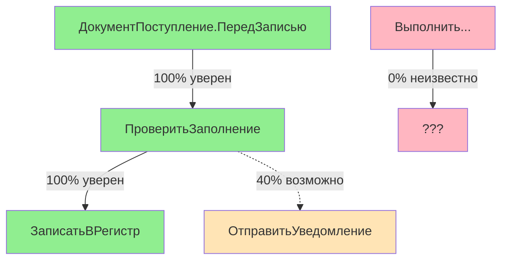

# Реалистичный подход Workflow Explorer

## Честная оценка возможностей

### Что мы можем vs что обещают другие

| Обещание | Реальность в 1С | Наш подход |
|----------|-----------------|------------|
| "Полный анализ всех путей выполнения" | Невозможно из-за Выполнить() и динамики | Показываем только то, что видим |
| "Автоматическая оптимизация процессов" | Требует понимания бизнес-логики | Предоставляем информацию для принятия решений |
| "Обнаружение всех узких мест" | Многие проблемы зависят от данных | Находим структурные проблемы |
| "100% точность анализа" | Динамическая типизация делает это невозможным | Показываем уровни уверенности |

## Модель уровней уверенности

```rust
pub enum ConfidenceLevel {
    Certain(100),      // Явный вызов: ОбработатьДокумент();
    Probable(70),      // Подписка на событие в метаданных
    Possible(40),      // Вызов в условии: Если X Тогда Метод();
    Unknown(0),        // Выполнить(ИмяМетода);
}

pub struct WorkflowEdge {
    pub from: NodeId,
    pub to: NodeId,
    pub confidence: ConfidenceLevel,
    pub evidence: Evidence,
}

pub enum Evidence {
    DirectCall { line: usize, file: String },
    EventSubscription { xml_path: String },
    ConditionalCall { condition: String },
    DynamicCall { reason: String },
}
```

## Области неопределённости

### Что помечаем как "чёрные ящики":

```rust
pub struct UnknownArea {
    pub location: SourceLocation,
    pub reason: UnknownReason,
    pub hint: Option<String>,
}

pub enum UnknownReason {
    DynamicExecution {
        // Выполнить("Метод" + Суффикс + "()");
        expression: String,
    },
    ExternalProcessing {
        // ВнешниеОбработки.Создать(ПутьКФайлу);
        path_variable: String,
    },
    DataDependency {
        // Если Регистр.Настройка = X Тогда ...
        register: String,
    },
    COMObject {
        // COMОбъект = Новый COMОбъект("Excel.Application");
        progid: String,
    },
    HTTPService {
        // HTTPСоединение.ВызватьHTTPМетод();
        endpoint: String,
    },
}
```

## Практический пример вывода



Легенда:
- 🟢 Зелёный - уверены (явные вызовы)
- 🟡 Жёлтый - вероятно (условные вызовы, метаданные)
- 🔴 Красный - неизвестно (динамические вызовы)

## Ценность для пользователей

### Для разработчиков:
✅ **Что получают:**
- Быстрое понимание структуры незнакомой конфигурации
- Карту явных зависимостей между модулями
- Список подписок и регламентных заданий
- Визуализацию документооборота

❌ **Чего НЕ получают:**
- Гарантию нахождения всех связей
- Анализ производительности
- Оптимизационные рекомендации

### Для LLM:
✅ **Что получают:**
- Контекст о структуре конфигурации
- Информацию о явных связях
- Шаблоны типовых процессов

❌ **Чего НЕ получают:**
- Полную картину всех возможных выполнений
- Информацию о частоте использования путей

## Сравнение с аналогами

### Enterprise Architect, Visio, draw.io
**Их подход:** Ручное рисование диаграмм
**Наш подход:** Автоматическое извлечение из кода
**Преимущество:** Всегда актуальная информация

### SonarQube, CodeClimate
**Их подход:** Метрики качества кода
**Наш подход:** Структура бизнес-логики
**Преимущество:** Понимание предметной области

### 1C:Enterprise Development Tools
**Их подход:** Отладка и профилирование
**Наш подход:** Статический анализ структуры
**Преимущество:** Не требует запуска системы

## Дорожная карта честных улучшений

### Версия 1.0 (MVP)
- Извлечение явных вызовов
- Базовая визуализация
- Пометка неизвестных областей

### Версия 2.0
- Парсинг подписок на события
- Анализ цепочек документов
- Уровни уверенности в визуализации

### Версия 3.0
- Интеграция с git историей (какие файлы меняются вместе)
- Эвристики для частых паттернов
- Экспорт в различные форматы

### Возможные расширения (требуют дополнительных данных)
- Интеграция с журналом регистрации (если есть доступ)
- Анализ технологического журнала (если включен)
- Пользовательские аннотации для уточнения связей

## Метрики успеха

### Реалистичные KPI:
- Находим 70%+ явных вызовов ✅
- Правильно определяем подписки на события ✅
- Строим корректные цепочки документов ✅
- Помечаем области с динамикой ✅

### Нереалистичные KPI:
- Находим 100% всех вызовов ❌
- Предсказываем производительность ❌
- Автоматически оптимизируем ❌

## Позиционирование

**НЕ позиционируем как:**
- "Полный анализатор workflow"
- "Инструмент оптимизации"
- "Автоматический рефакторинг"

**Позиционируем как:**
- "Исследователь структуры кода"
- "Помощник в понимании системы"
- "Визуализатор явных связей"
- "Детектор областей неопределённости"

## Примеры использования

### Сценарий 1: Новый разработчик в проекте
```bash
# Хочу понять, как работает документ РеализацияТоваров
workflow_explorer --document "РеализацияТоваров" --show-all

# Вывод:
# ✅ Найдено 15 явных вызовов
# ⚠️ Найдено 3 условных вызова
# ❌ Обнаружено 2 области с динамическими вызовами
```

### Сценарий 2: Поиск точек входа
```bash
# Что вызывает метод ПересчитатьОстатки?
workflow_explorer --find-callers "ПересчитатьОстатки"

# Вывод:
# Прямые вызовы:
# - Документы.Поступление.ПриПроведении (100% уверен)
# - РегламентныеЗадания.ОбновлениеОстатков (из метаданных)
# Возможные вызовы:
# - ОбщийМодуль.УправлениеЗапасами.ОбработатьДокумент (в условии)
```

## Заключение

Workflow Explorer - это честный инструмент, который:
1. Показывает то, что может увидеть
2. Признаёт свои ограничения
3. Помогает понять структуру системы
4. Не обещает невозможного

Это делает его полезным и надёжным помощником, а не источником ложной уверенности.