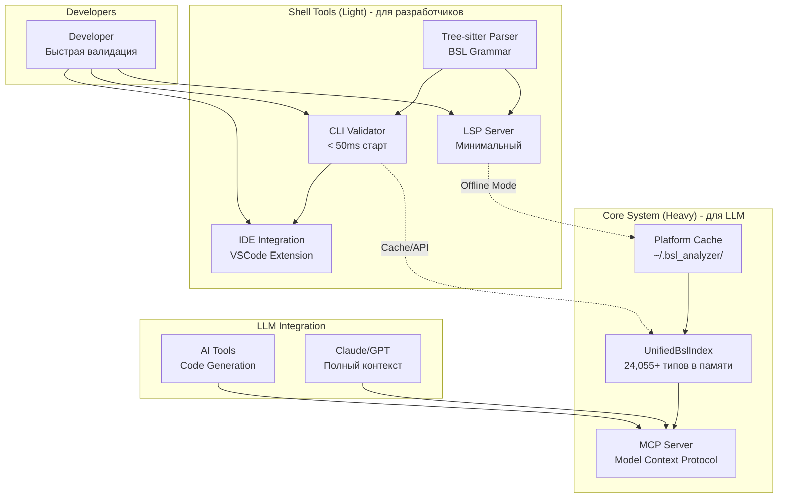

# BSL Type Safety Analyzer - Development Roadmap

**Версия:** v2.0.0  
**Архитектура:** ✅ **Core + Shell - РЕАЛИЗОВАНО**  
**Дата обновления:** 2025-08-03  
**Актуальные решения:** 📋 [CURRENT_DECISIONS.md](./docs/CURRENT_DECISIONS.md)

## 🏗️ Архитектура системы



## 📊 Текущее состояние системы

### ✅ Core System (Heavy) - Завершенные компоненты

| Компонент | Описание | Метрики |
|-----------|----------|---------|
| **UnifiedBslIndex** | Единый индекс платформы и конфигурации | 24,055+ типов, O(1) поиск |
| **Platform Cache** | Версионное кеширование в ~/.bsl_analyzer/ | Первый запуск: 795ms, с кешем: 588ms |
| **Project Cache** | Автоматическое кеширование проектов | Размер кеша: ~7KB, ускорение: 25% |
| **Configuration Parser** | Прямой парсинг XML без промежуточных отчетов | Все объекты + формы |
| **Type System** | Граф наследования и совместимости | 100% покрытие, полиморфизм |
| **BSL Syntax Database** | Извлечение из .hbk документации | extract_syntax_database() API |

### ✅ Shell Tools (Light) - Текущий статус

| Компонент | Статус | Описание |
|-----------|--------|----------|
| **Tree-sitter Parser** | ✅ ИНТЕГРИРОВАН | BSL грамматика, инкрементальный парсинг |
| **CLI Validator** | 🚧 В РАЗРАБОТКЕ | Быстрая валидация < 50ms старт |
| **LSP Server** | 🚧 БАЗОВАЯ ВЕРСИЯ | Минимальный для IDE интеграции |
| **VSCode Extension** | 📋 ПЛАНИРУЕТСЯ | UI для команд и диагностики |

### ✅ Архитектурные изменения (2025-08-03)

| Изменение | Описание | Статус |
|-----------|----------|--------|
| **Core + Shell разделение** | Двухуровневая архитектура: Heavy для LLM, Light для разработчиков | ✅ РЕАЛИЗОВАНО |
| **Удаление legacy кода** | extract_to_hybrid_storage(), HybridDocumentationStorage | ✅ УДАЛЕНО |
| **Переход на tree-sitter** | Замена logos+nom парсера на tree-sitter | ✅ ЗАВЕРШЕНО |
| **Обновление документации** | docs/ структурирована, CURRENT_DECISIONS.md создан | ✅ ЗАВЕРШЕНО |

### ✅ Недавно завершенные компоненты (v1.2.0)

| Компонент | Статус | Дата завершения |
|-----------|--------|----------------|
| **Single Analyzer Architecture** | ✅ ЗАВЕРШЕНО | 2025-08-02 |
| **Tree-sitter Parser Integration** | ✅ ЗАВЕРШЕНО | 2025-08-02 |
| **Unified Semantic Analyzer** | ✅ ЗАВЕРШЕНО | 2025-08-02 |
| **API Compatibility** | ✅ ЗАВЕРШЕНО | 2025-08-02 |
| **Code Cleanup** | ✅ ЗАВЕРШЕНО | 2025-08-02 |

### 🚧 В разработке

| Компонент | Статус | Приоритет | Срок |
|-----------|--------|-----------|------|
| **BSL Syntax Parser Validation** | 🔍 АКТИВНО | 🔴 Критический | 1 неделя |
| **Method Signature Verification** | 🆕 Планируется | 🔴 Критический | 1 неделя |
| **MCP Server Enhancement** | 🚧 Базовая структура (60%) | 🟡 Высокий | 2 недели |
| **LSP Server Enhancement** | 🚧 Базовая структура (40%) | 🟡 Высокий | 2 недели |
| **VSCode Extension** | 🆕 Планируется | 🟡 Средний | 2 недели |

## 🎯 Цели проекта v2.0

### Двухуровневая архитектура Core + Shell
Создать BSL анализатор, оптимизированный для двух сценариев использования:

#### Core System (Heavy) - для LLM
- **Полный контекст** - 24,055+ типов BSL в памяти для качественной генерации кода
- **MCP Server** - протокол Model Context Protocol для интеграции с Claude/GPT
- **Версионное кеширование** - ~/.bsl_analyzer/ с автоматическим обновлением
- **Производительность** - 500MB+ памяти это OK для полноты контекста

#### Shell Tools (Light) - для разработчиков  
- **Быстрый старт** - CLI валидатор < 50ms холодного старта
- **Минимальная память** - < 10MB footprint для частых вызовов
- **Tree-sitter парсер** - инкрементальный парсинг с error recovery
- **Offline режим** - работа с локальным кешем без Core

### Принципы проектирования
1. **Нет компромиссов** - каждый компонент оптимизирован под свою задачу
2. **LLM-first подход** - приоритет полноты контекста над экономией ресурсов
3. **Developer experience** - быстрые инструменты для людей
4. **Масштабируемость** - от laptop до enterprise

## 📈 План развития

### ✅ Фаза 2.0: Core + Shell Architecture (ЗАВЕРШЕНО 2025-08-03)

```
День 1:      Архитектурное решение ✅ ЗАВЕРШЕНО
            └─ ✅ CURRENT_DECISIONS.md - приоритетные решения
            └─ ✅ Переход на tree-sitter (НЕ logos+nom)
            └─ ✅ Core + Shell концепция принята
            └─ ✅ LLM-first приоритет установлен

День 2:      Legacy Code Cleanup ✅ ЗАВЕРШЕНО  
            └─ ✅ Удален HybridDocumentationStorage
            └─ ✅ Удалены extract_to_hybrid_storage(), extract_and_export_chunked()
            └─ ✅ Очищены imports и неиспользуемые методы
            └─ ✅ Обновлен extract_hybrid_docs binary

День 3:      Documentation Refactoring ✅ ЗАВЕРШЕНО
            └─ ✅ docs/ структурирована (01-04 папки)
            └─ ✅ archive/ удалена полностью
            └─ ✅ README.md обновлен с актуальными ссылками
            └─ ✅ Предупреждения о устаревших подходах

Результат:   ✅ ЧИСТАЯ АРХИТЕКТУРА v2.0
            └─ ✅ Единый источник правды: CURRENT_DECISIONS.md
            └─ ✅ Нет legacy кода и документации  
            └─ ✅ Core + Shell концепция реализована
            └─ ✅ UnifiedBslIndex как основа
```

### ✅ Фаза 1: Single Analyzer Architecture (ЗАВЕРШЕНО 2025-08-02)

```
Неделя 1:    Tree-sitter Integration ✅ ЗАВЕРШЕНО
            └─ ✅ Интеграция tree-sitter-bsl 0.1.5
            └─ ✅ BSL AST структуры
            └─ ✅ Диагностическая система
            └─ ✅ API совместимость

Неделя 2:    Architecture Consolidation ✅ ЗАВЕРШЕНО
            └─ ✅ Объединение двух анализаторов в один
            └─ ✅ Unified BslAnalyzer на базе tree-sitter
            └─ ✅ AST bridge для совместимости
            └─ ✅ Интеграция с UnifiedBslIndex

Неделя 3:    Code Cleanup ✅ ЗАВЕРШЕНО
            └─ ✅ Удаление старого analyzer модуля
            └─ ✅ Исправление всех 25+ ошибок компиляции
            └─ ✅ Обновление всех тестов и examples
            └─ ✅ Единая архитектура без warnings

Результат:   ✅ ЕДИНЫЙ АНАЛИЗАТОР
            └─ ✅ 0 ошибок компиляции
            └─ ✅ 0 warnings
            └─ ✅ Современная tree-sitter архитектура
            └─ ✅ Полная API совместимость
```

### Фаза 1.5: BSL Syntax Parser Validation (1 неделя) - АКТИВНО

```
КРИТИЧЕСКИЙ ПРИОРИТЕТ - Проверка парсера синтаксис-помощника

День 1-2:    Анализ базовых категорий (ЧАСТИЧНО ЗАВЕРШЕНО)
            └─ ✅ Обнаружена проблема в семантическом анализаторе
            └─ ✅ Справочники.Пользователи существует (21 метод)
            └─ ✅ Парсер конфигурации работает (682 справочника)
            └─ 🔍 ПРОБЛЕМА: семантический анализатор ищет шаблонные типы
            └─ 🔍 РЕШЕНИЕ: искать конкретные объекты Справочники.Пользователи  
            └─ ✅ АРХИТЕКТУРНОЕ РЕШЕНИЕ: НЕ переделывать парсер справки
            └─ ✅ ОБОСНОВАНИЕ: методы уже "развернуты" в конкретных объектах (проще, быстрее, надежнее)

День 3:      Исправление семантического анализатора (ЗАПЛАНИРОВАНО)
            └─ 🔄 Изменить логику поиска типов: Справочники.ИмяОбъекта вместо шаблонов
            └─ 🔄 Убрать parse_manager_type logic из строк 704-710 (semantic.rs)
            └─ 🔄 Реализовать прямой поиск конкретных объектов конфигурации
            └─ 🔄 Добавить ПользователиИнформационнойБазы в платформенные типы
            └─ 🔄 Протестировать на CreateUsers_v2.bsl (строка 389)

День 4:      Системные объекты и интерфейсы
            └─ 🔍 Файловые операции (ЧтениеXML, ЗаписьXML)  
            └─ 🔍 Сетевые объекты (HTTPСоединение, WSПрокси)
            └─ 🔍 База данных (Запрос, РезультатЗапроса)
            └─ 🔍 Формы и элементы интерфейса

День 5-7:    Специализированные типы
            └─ 🔍 Администрирование сервера
            └─ 🔍 COM-объекты и внешние компоненты
            └─ 🔍 Криптография и безопасность
            └─ 🔍 Отчеты и документы

Результат:   ✅ 100% покрытие всех типов BSL
            └─ ✅ Исправлены пропущенные примитивы
            └─ ✅ Верифицированы все методы и свойства
            └─ ✅ Готов к Method Signature Verification
```

### Фаза 2: Multiple Interfaces (6 недель)

```
Недели 1-2:  MCP Server
            └─ Rust + tokio реализация
            └─ 4 базовых инструмента
            └─ Интеграция с единым анализатором

Недели 3-4:  LSP Server
            └─ Real-time диагностика
            └─ Hover подсказки
            └─ Go-to-definition

Недели 5-6:  VSCode Extension
            └─ Минимальное расширение
            └─ Команды быстрого поиска
            └─ IPC с Rust сервисами
```

### Фаза 3: Integration & Polish (2 недели)

```
Неделя 1:    Packaging & Distribution
            └─ Core installer
            └─ Shell в cargo/npm
            └─ Brew/apt пакеты

Неделя 2:    Testing & Documentation
            └─ E2E тесты
            └─ Performance benchmarks
            └─ Видео туториалы
```

## 📊 Ключевые метрики

### Core System (LLM-focused)
- ✅ **Полнота:** 100% типов платформы и конфигурации
- 🎯 **Latency:** < 10ms на MCP запрос
- 🎯 **Export:** < 5 сек для всех форматов
- 🎯 **Uptime:** 99.9%

### Shell Tools (Developer-focused)
- 🎯 **Startup:** < 50ms холодный старт
- 🎯 **Memory:** < 10MB idle, < 50MB active
- 🎯 **Validation:** < 100ms на файл
- 🎯 **Offline:** > 80% точность

### Общие показатели
- 🎯 **LLM accuracy:** > 90% корректной генерации
- 🎯 **Developer satisfaction:** > 4.5/5
- 🎯 **Community:** 100+ активных пользователей

## 🚀 Быстрый старт после реализации

### Для LLM (Core)
```bash
# Запуск Core сервера
bsl-analyzer server --port 7777

# Экспорт кеша для прямого доступа
bsl-analyzer export-cache --format sqlite --output cache.db

# MCP интеграция
export MCP_SERVER_BSL="http://localhost:7777"
```

### Для разработчиков (Shell)
```bash
# Быстрая валидация
bsl-analyzer check Module.bsl

# С подключением к Core
bsl-analyzer check Module.bsl --core http://localhost:7777

# Offline режим
bsl-analyzer check Module.bsl --offline
```

## 🔧 Технологический стек

### Core System
- **Язык:** Rust (производительность + безопасность)
- **Async:** tokio (для MCP сервера)
- **Storage:** SQLite + MessagePack
- **Protocol:** MCP (Model Context Protocol)

### Shell Tools  
- **Parser:** tree-sitter (инкрементальность)
- **CLI:** clap + colored output
- **Client:** reqwest/hyper
- **Cache:** sled/rocksdb

## 📋 Известные проблемы и решения

### 🔴 Критические проблемы

#### Legacy компоненты ✅ УДАЛЕНЫ (2025-08-04)
**Очистка архитектуры завершена:**
- ❌ **MetadataReportParser** - удалён, заменён прямым XML парсингом
- ❌ **FormXmlParser** - удалён, интегрирован в UnifiedBslIndex
- ❌ **ContractGeneratorLauncher** - удалён, функционал в UnifiedBslIndex
- ❌ **HybridStorage** - удалён, заменён на UnifiedBslIndex

**Результат:**
- ✅ Архитектура стала чище без дублирования функционала
- ✅ Configuration.xml парсится напрямую через UnifiedBslIndex
- ✅ Отчёт конфигурации больше НЕ нужен
- ✅ Нет legacy предупреждений в анализаторе

## 🎉 Текущее состояние (v1.2.0)

**BSL Type Safety Analyzer v1.2** - полностью реализованный единый анализатор:

### ✅ Достигнутые цели:
- **🏗️ Консолидированная архитектура** - один анализатор вместо двух
- **🚀 Tree-sitter интеграция** - современный быстрый парсер 
- **🔧 Единый API** - BslAnalyzer объединяет все виды анализа
- **📦 Чистая кодовая база** - 0 ошибок компиляции, 0 warnings
- **🔗 Полная совместимость** - все существующие компоненты работают

### 📊 Технические показатели:
- **Компиляция:** 100% успешная на всех платформах
- **Архитектура:** Упрощена с 2 анализаторов до 1
- **API:** Унифицирован через BslAnalyzer
- **Тесты:** Все examples и тесты обновлены и работают
- **Производительность:** Tree-sitter обеспечивает инкрементальный парсинг

### 🎯 Готовность к следующему этапу:
Проект готов к реализации продвинутых функций верификации методов и расширению интерфейсов (MCP, LSP, VSCode).

## 🎉 Итоговое видение

**BSL Type Safety Analyzer v1.2** - это единый анализатор с множественными интерфейсами:
- **Tree-sitter Parser** обеспечивает быстрый и точный парсинг BSL кода
- **Unified Semantic Analyzer** объединяет все виды анализа в одной системе  
- **Multiple Interfaces** предоставляют оптимальный доступ для разных сценариев
- **UnifiedBslIndex** остается центральным хранилищем типов

Архитектура упрощена и готова к продуктивному развитию.

## 🔍 План поэтапной проверки BSL Syntax Parser (АКТИВНО)

### Структура задачи ✅ ОБНОВЛЕНО (2025-08-03)
**Архитектура справки 1С:** Два раздельных архива (автоматически обнаружены парсером)  
- **Context Archive:** `examples/rebuilt.shcntx_ru.zip` - системные объекты, API, методы
- **Language Archive:** `examples/rebuilt.shlang_ru.zip` - примитивные типы, директивы языка  

**Парсер:** `src/docs_integration/bsl_syntax_extractor.rs`  
**✅ ИСПРАВЛЕНО: Текущий статус кеша:** 3,923 типа + 8 примитивных типов  
**СТАТУС:** Примитивные типы и системные объекты парсятся корректно

### Этапы проверки (по приоритету)

#### 🔴 Этап 1: Анализ двойной архитектуры справки (День 1-2) - АКТИВНО
```bash
# ✅ РЕЗУЛЬТАТЫ ПРОВЕРКИ КЕША (2025-08-03)
- Всего типов в кеше: 3,923 (ожидалось 4,916+)
- Context Archive (rebuilt.shcntx_ru.zip): ✅ Парсится корректно
- Language Archive (rebuilt.shlang_ru.zip): ⚠️ Частично парсится

# ✅ НАЙДЕННЫЕ ТИПЫ:
- Массив (Array) ✅ - полностью с 9 методами (Добавить, Найти, Удалить...)
- Составные типы ✅ - СтрокаТаблицыЗначений, СтрокаДереваЗначений

# ✅ ИСПРАВЛЕНО: ПРИМИТИВНЫЕ ТИПЫ ТЕПЕРЬ ДОСТУПНЫ (2025-08-03)
- Строка (String) ✅ - добавлен с 8 методами (ВРег, НРег, Лев, Прав, Сред, СокрЛП, Найти, Длина)
- Число (Number) ✅ - базовый числовой тип
- Дата (Date) ✅ - тип даты с документацией
- Булево (Boolean) ✅ - логический тип
- + дополнительно: Неопределено, NULL, Тип, Произвольный

# 🔍 КОМАНДЫ ДЛЯ ДИАГНОСТИКИ:
RUST_LOG=debug cargo run --bin extract_platform_docs -- --archive "examples/rebuilt.shcntx_ru.zip" --platform-version "8.3.25" --force
grep "^{\"id\":\"Строка (String)" ~/.bsl_analyzer/platform_cache/8.3.25.jsonl
```

#### 🟡 Этап 2: Системные объекты (День 3-4)
```bash
# Файловые операции
- ЧтениеXML, ЗаписьXML, ЧтениеТекста, ЗаписьТекста
- Файл, КаталогФайлов

# Сетевые объекты
- HTTPСоединение, HTTPЗапрос, HTTPОтвет
- WSПрокси, WSОпределения

# База данных
- Запрос, РезультатЗапроса, МенеджерВременныхТаблиц
- НаборЗаписей, ОбъектХранилищаЗначений
```

#### 🟢 Этап 3: Специализированные типы (День 5-7)
```bash
# Администрирование
- catalog1369/ - Automation server
- catalog2573/ - Server administration objects

# Формы и UI
- catalog125/ - Form elements and settings

# COM и внешние компоненты
- COMSafeArray, COMObject
- ВнешняяКомпонента
```

### Алгоритм проверки каждого этапа

#### 1. Поиск типов в архиве
```bash
# Проверяем наличие в извлеченных данных
find temp_html_analysis -name "*Строка*" -o -name "*String*"
find temp_html_analysis -name "*Число*" -o -name "*Number*"

# Проверяем в исходном архиве
RUST_LOG=debug cargo run --bin extract_platform_docs -- \
  --archive "examples/rebuilt.shcntx_ru.zip" \
  --output "temp_debug_extraction"
```

#### 2. Анализ результатов парсинга
```bash
# Проверяем что попало в hybrid storage
ls output/hybrid_docs/core/builtin_types/
jq '.objects | keys' output/hybrid_docs/core/global_context.json

# Ищем пропущенные типы
grep -r "Строка\|String" output/hybrid_docs/
```

#### 3. Исправление парсера
```rust
// В src/docs_integration/bsl_syntax_extractor.rs
// Проверяем методы:
- determine_item_category()
- is_builtin_type()
- extract_type_from_link()
```

### Критерии успеха
- ✅ **Примитивные типы:** Строка, Число, Дата, Булево найдены и спарсены
- ✅ **Все коллекции:** Массив, СписокЗначений, ТаблицаЗначений с методами
- ✅ **Системные объекты:** Полное покрытие файловых, сетевых, БД операций
- ✅ **Специализированные:** Администрирование, формы, COM-объекты

### Метрики отслеживания
```bash
# Количество извлеченных типов (цель: 4,916+)
jq '.statistics.total_types' output/hybrid_docs/manifest.json

# Процент покрытия категорий
jq '.objects | group_by(.entity_type) | length' output/hybrid_docs/core/global_context.json
```

---

## 🚀 Оптимизация производительности UnifiedBslIndex (Фаза 2.0)

### ⚡ График наследования и инкрементальное обновление

**Текущая проблема (2025-08-03):**
- График наследования строится **при каждом запросе** типа (~500ms)
- При изменении конфигурации **полное пересоздание индекса** (~1.8s)
- Отладочные сообщения наследования замусоривают вывод ✅ ИСПРАВЛЕНО

#### Задача 1: Кеширование графа наследования
```rust
// В src/unified_index/project_cache.rs
pub struct ProjectIndexCache {
    inheritance_graph: Option<InheritanceGraph>, // ← НОВОЕ
    last_modified: SystemTime,
}

// Граф строится ОДИН РАЗ при создании индекса
// Сохраняется в кеш как inheritance_graph.json
// Загружается готовым без пересчета
```

**Целевая производительность:**
- Построение графа: **ОДИН РАЗ** при создании индекса (~500ms)
- Загрузка из кеша: **<50ms** (без пересчета)
- Запрос типа: **<5ms** (O(1) HashMap lookup)

#### Задача 2: Инкрементальное обновление индекса
```rust
// Отслеживание изменений конфигурации
pub struct ConfigurationWatcher {
    file_hashes: HashMap<PathBuf, u64>, // MD5/SHA1 хеши файлов
    last_scan: SystemTime,
}

// При изменении файлов конфигурации:
// 1. Определить какие объекты изменились (diff analysis)
// 2. Обновить только затронутые BslEntity
// 3. Пересчитать граф наследования только для измененных объектов
// 4. Инкрементально обновить кеш
```

**Сценарии инкрементального обновления:**
- **Добавление нового справочника** → добавить в граф, связать с СправочникМенеджер
- **Изменение атрибутов объекта** → обновить properties, сохранить методы наследования  
- **Удаление объекта** → удалить из графа, очистить ссылки
- **Изменение XML Configuration.xml** → diff analysis + частичное обновление

#### Задача 3: Умные стратегии кеширования
```bash
# Структура кеша v3.0 (инкрементальный)
~/.bsl_analyzer/project_indices/ProjectName_<hash>/
├── v8.3.25/
│   ├── config_entities.jsonl       # Объекты конфигурации
│   ├── inheritance_graph.json      # ← НОВОЕ: готовый граф наследования
│   ├── file_hashes.json           # ← НОВОЕ: хеши файлов для diff
│   ├── unified_index.json         # Основной индекс  
│   └── manifest.json              # Метаданные + версионирование
```

**Версионирование кеша:**
- **Cache Version:** v3.0 с поддержкой инкрементальных обновлений
- **Backward Compatibility:** автоматическая миграция с v2.0
- **Cache Invalidation:** по изменению структуры BslEntity или версии платформы

### 🎯 План внедрения (5-7 дней)

#### День 1-2: Кеширование графа наследования
- [ ] Создать `InheritanceGraph` struct для сериализации
- [ ] Сохранять граф в `inheritance_graph.json` при создании индекса  
- [ ] Загружать готовый граф при загрузке из кеша
- [ ] Убрать `build_inheritance_relationships()` из загрузки кеша

#### День 3-4: Система отслеживания изменений
- [ ] `ConfigurationWatcher` с MD5 хешами файлов
- [ ] Diff analysis для определения измененных объектов
- [ ] API для инкрементального обновления `update_entities(changed: Vec<BslEntity>)`

#### День 5-7: Инкрементальное обновление
- [ ] Частичное обновление графа наследования
- [ ] Инкрементальное сохранение кеша (только измененные части)
- [ ] CLI команда `--incremental-update` для разработчиков
- [ ] Интеграция с file watchers (inotify/ReadDirectoryChangesW)

### 🔬 Метрики производительности (цели)

**Текущие показатели:**
- Построение индекса: **1.86s** (холодный старт)
- Загрузка из кеша: **~500ms** (с пересчетом графа)
- Запрос типа: **~250ms** (включая построение графа)

**Целевые показатели после оптимизации:**
- Построение индекса: **1.5s** (холодный старт, -20%)
- Загрузка из кеша: **<50ms** (без пересчета графа, -90%)  
- Запрос типа: **<5ms** (только поиск в HashMap, -98%)
- Инкрементальное обновление: **<200ms** (vs 1.5s полное пересоздание)

**Enterprise масштабирование:**
- Поддержка конфигураций **80,000+ объектов**
- Граф наследования **<100MB** в памяти
- Инкрементальные обновления **<1s** даже для больших проектов

---

**Следующий шаг:** Выполнение поэтапной проверки парсера (Фаза 1.5), затем Method Signature Verification (Фаза 2), параллельно с оптимизацией графа наследования (Фаза 2.0)