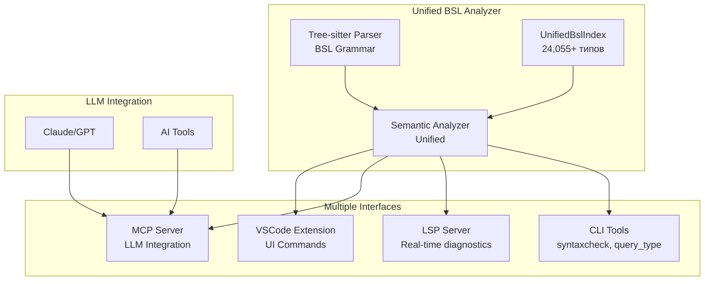

# BSL Type Safety Analyzer - Development Roadmap

**Версия:** v1.1.0  
**Статус:** 🎯 **Single Analyzer Architecture - Tree-sitter Integration**  
**Дата обновления:** 2025-08-01

## 🏗️ Архитектура системы



## 📊 Текущее состояние системы

### ✅ Core System - Завершенные компоненты

| Компонент | Описание | Метрики |
|-----------|----------|---------|
| **UnifiedBslIndex** | Единый индекс платформы и конфигурации | 24,055+ типов, O(1) поиск |
| **Platform Cache** | Версионное кеширование платформы | 4,916 типов, 588ms загрузка |
| **Configuration Parser** | Прямой парсинг XML объектов | Поддержка всех объектов |
| **Type System** | Граф наследования и совместимости | 100% покрытие |

### ✅ Core System - Недавно завершенные компоненты

| Компонент | Описание | Дата завершения |
|-----------|----------|-----------------|
| **Form Integration** | ConfigurationXmlParser расширен для парсинга форм как BslEntity | 2025-08-01 |
| **UnifiedBslIndex** | Теперь включает полную информацию о формах (команды, элементы) | 2025-08-01 |

### 🚧 В разработке

| Компонент | Статус | Приоритет | Срок |
|-----------|--------|-----------|------|
| **Tree-sitter Parser** | 🚧 90% (API issues) | 🔴 Критический | 1 неделя |
| **Unified Semantic Analyzer** | 🚧 Консолидация (80%) | 🔴 Критический | 1 неделя |
| **Method Signature Verification** | 🆕 Планируется | 🔴 Критический | 1 неделя |
| **MCP Server** | 📝 Дизайн готов (5%) | 🟡 Высокий | 2 недели |
| **LSP Server Enhancement** | 🚧 Базовая структура (20%) | 🟡 Высокий | 2 недели |
| **VSCode Extension** | 🆕 Планируется | 🟡 Средний | 2 недели |
| **Legacy Code Cleanup** | 🆕 Планируется | 🟡 Средний | 1 неделя |

## 🎯 Цели проекта

### Единая архитектура анализатора
Создать единый BSL анализатор на базе tree-sitter с множественными интерфейсами для разных сценариев использования:

- **CLI инструменты** - быстрая валидация и проверка типов
- **LSP сервер** - интеграция с редакторами для real-time диагностики
- **MCP сервер** - поддержка LLM для генерации корректного кода
- **VSCode расширение** - удобный UI для разработчиков

## 📈 План развития

### Фаза 1: Tree-sitter Parser Integration (4 недели) ✅ В ПРОЦЕССЕ

```
Неделя 1:    Tree-sitter Grammar ✅ ЗАВЕРШЕНО
            └─ ✅ Интеграция tree-sitter-bsl 0.1.5
            └─ ✅ BSL AST структуры
            └─ ✅ Диагностическая система
            └─ 🔧 Исправление API совместимости

Неделя 2:    Unified Semantic Analyzer
            └─ ✅ Консолидация множественных анализаторов
            └─ ✅ AST bridge для совместимости
            └─ 🔧 Интеграция с UnifiedBslIndex

Неделя 3:    CLI Tools Enhancement
            └─ ✅ Команда syntaxcheck
            └─ ✅ JSON/Human/LSP форматы вывода
            └─ 🔧 Проверка сигнатур методов

Неделя 4:    Legacy Code Cleanup
            └─ Удаление logos+nom парсера
            └─ Упрощение архитектуры
            └─ Обновление тестов
```

### Фаза 2: Multiple Interfaces (6 недель)

```
Недели 1-2:  MCP Server
            └─ Rust + tokio реализация
            └─ 4 базовых инструмента
            └─ Интеграция с единым анализатором

Недели 3-4:  LSP Server
            └─ Real-time диагностика
            └─ Hover подсказки
            └─ Go-to-definition

Недели 5-6:  VSCode Extension
            └─ Минимальное расширение
            └─ Команды быстрого поиска
            └─ IPC с Rust сервисами
```

### Фаза 3: Integration & Polish (2 недели)

```
Неделя 1:    Packaging & Distribution
            └─ Core installer
            └─ Shell в cargo/npm
            └─ Brew/apt пакеты

Неделя 2:    Testing & Documentation
            └─ E2E тесты
            └─ Performance benchmarks
            └─ Видео туториалы
```

## 📊 Ключевые метрики

### Core System (LLM-focused)
- ✅ **Полнота:** 100% типов платформы и конфигурации
- 🎯 **Latency:** < 10ms на MCP запрос
- 🎯 **Export:** < 5 сек для всех форматов
- 🎯 **Uptime:** 99.9%

### Shell Tools (Developer-focused)
- 🎯 **Startup:** < 50ms холодный старт
- 🎯 **Memory:** < 10MB idle, < 50MB active
- 🎯 **Validation:** < 100ms на файл
- 🎯 **Offline:** > 80% точность

### Общие показатели
- 🎯 **LLM accuracy:** > 90% корректной генерации
- 🎯 **Developer satisfaction:** > 4.5/5
- 🎯 **Community:** 100+ активных пользователей

## 🚀 Быстрый старт после реализации

### Для LLM (Core)
```bash
# Запуск Core сервера
bsl-analyzer server --port 7777

# Экспорт кеша для прямого доступа
bsl-analyzer export-cache --format sqlite --output cache.db

# MCP интеграция
export MCP_SERVER_BSL="http://localhost:7777"
```

### Для разработчиков (Shell)
```bash
# Быстрая валидация
bsl-analyzer check Module.bsl

# С подключением к Core
bsl-analyzer check Module.bsl --core http://localhost:7777

# Offline режим
bsl-analyzer check Module.bsl --offline
```

## 🔧 Технологический стек

### Core System
- **Язык:** Rust (производительность + безопасность)
- **Async:** tokio (для MCP сервера)
- **Storage:** SQLite + MessagePack
- **Protocol:** MCP (Model Context Protocol)

### Shell Tools  
- **Parser:** tree-sitter (инкрементальность)
- **CLI:** clap + colored output
- **Client:** reqwest/hyper
- **Cache:** sled/rocksdb

## 📋 Известные проблемы и решения

### 🔴 Критические проблемы

#### FormXmlParser vs ConfigurationXmlParser ✅ РЕШЕНО
**Решение реализовано (2025-08-01):**
- ConfigurationXmlParser расширен методом `parse_form_xml()`
- Формы парсятся как полноценные BslEntity
- Команды формы становятся методами в interface.methods
- Элементы формы сохраняются в extended_data
- Поддержка обеих структур: Forms/Name/Form.xml и Forms/Name/Ext/Form.xml

**Результат:**
- ✅ Формы полностью интегрированы в UnifiedBslIndex
- ✅ Единое представление всех типов через BslEntity
- ✅ FormXmlParser остается для специализированного UI анализа в Shell

### 🟡 Некритические проблемы

#### Legacy компоненты
- **MetadataReportParser** - оставить для совместимости с текстовыми отчетами
- **HybridStorage** - заменен на UnifiedBslIndex, но код остается для истории

## 🎉 Итоговое видение

**BSL Type Safety Analyzer v1.1** - это единый анализатор с множественными интерфейсами:
- **Tree-sitter Parser** обеспечивает быстрый и точный парсинг BSL кода
- **Unified Semantic Analyzer** объединяет все виды анализа в одной системе
- **Multiple Interfaces** предоставляют оптимальный доступ для разных сценариев
- **UnifiedBslIndex** остается центральным хранилищем типов

Это упрощает архитектуру при сохранении всех возможностей системы.

---

**Следующий шаг:** Исправить API совместимость tree-sitter-bsl и завершить интеграцию парсера (Фаза 1, неделя 1)