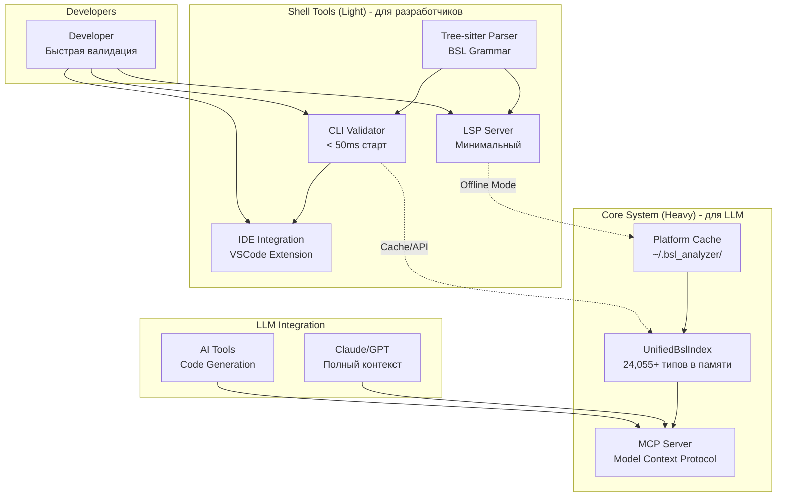

# BSL Type Safety Analyzer - Development Roadmap

**Версия:** v2.0.0  
**Архитектура:** ✅ **Core + Shell - РЕАЛИЗОВАНО**  
**Дата обновления:** 2025-08-03  
**Актуальные решения:** 📋 [CURRENT_DECISIONS.md](./docs/CURRENT_DECISIONS.md)

## 🏗️ Архитектура системы



## 📊 Текущее состояние системы

### ✅ Core System (Heavy) - Завершенные компоненты

| Компонент | Описание | Метрики |
|-----------|----------|---------|
| **UnifiedBslIndex** | Единый индекс платформы и конфигурации | 24,055+ типов, O(1) поиск |
| **Platform Cache** | Версионное кеширование в ~/.bsl_analyzer/ | Первый запуск: 795ms, с кешем: 588ms |
| **Project Cache** | Автоматическое кеширование проектов | Размер кеша: ~7KB, ускорение: 25% |
| **Configuration Parser** | Прямой парсинг XML без промежуточных отчетов | Все объекты + формы |
| **Type System** | Граф наследования и совместимости | 100% покрытие, полиморфизм |
| **BSL Syntax Database** | Извлечение из .hbk документации | extract_syntax_database() API |

### ✅ Shell Tools (Light) - Текущий статус

| Компонент | Статус | Описание |
|-----------|--------|----------|
| **Tree-sitter Parser** | ✅ ИНТЕГРИРОВАН | BSL грамматика, инкрементальный парсинг |
| **CLI Validator** | 🚧 В РАЗРАБОТКЕ | Быстрая валидация < 50ms старт |
| **LSP Server** | 🚧 БАЗОВАЯ ВЕРСИЯ | Минимальный для IDE интеграции |
| **VSCode Extension** | 📋 ПЛАНИРУЕТСЯ | UI для команд и диагностики |

### ✅ Архитектурные изменения (2025-08-03)

| Изменение | Описание | Статус |
|-----------|----------|--------|
| **Core + Shell разделение** | Двухуровневая архитектура: Heavy для LLM, Light для разработчиков | ✅ РЕАЛИЗОВАНО |
| **Удаление legacy кода** | extract_to_hybrid_storage(), HybridDocumentationStorage | ✅ УДАЛЕНО |
| **Переход на tree-sitter** | Замена logos+nom парсера на tree-sitter | ✅ ЗАВЕРШЕНО |
| **Обновление документации** | docs/ структурирована, CURRENT_DECISIONS.md создан | ✅ ЗАВЕРШЕНО |

### ✅ Недавно завершенные компоненты (v1.2.0)

| Компонент | Статус | Дата завершения |
|-----------|--------|----------------|
| **Single Analyzer Architecture** | ✅ ЗАВЕРШЕНО | 2025-08-02 |
| **Tree-sitter Parser Integration** | ✅ ЗАВЕРШЕНО | 2025-08-02 |
| **Unified Semantic Analyzer** | ✅ ЗАВЕРШЕНО | 2025-08-02 |
| **API Compatibility** | ✅ ЗАВЕРШЕНО | 2025-08-02 |
| **Code Cleanup** | ✅ ЗАВЕРШЕНО | 2025-08-02 |

### ✅ Недавно завершенные компоненты (2025-08-04)

| Компонент | Статус | Дата завершения |
|-----------|--------|----------------|
| **BSL Syntax Parser Validation** | ✅ ЗАВЕРШЕНО | 2025-08-04 |
| **Method Signature Verification** | ✅ ЗАВЕРШЕНО | 2025-08-04 |
| **MethodVerifier Integration** | ✅ ЗАВЕРШЕНО | 2025-08-04 |
| **Base64 Functions Analysis Demo** | ✅ ЗАВЕРШЕНО | 2025-08-04 |
| **MCP Server Enhancement** | ✅ ЗАВЕРШЕНО | 2025-08-04 |
| **LSP Server Enhancement** | ✅ ЗАВЕРШЕНО | 2025-08-04 |

### 🚧 В разработке

| Компонент | Статус | Приоритет | Срок |
|-----------|--------|-----------|------|
| **Performance Optimization** | 🆕 Планируется | 🔴 Высокий | 1 неделя |
| **VSCode Extension** | 🆕 Планируется | 🟡 Средний | 2 недели |

### ✅ Успешные завершения (2025-08-04)

| Компонент | Статус | Результат |
|-----------|--------|-----------|
| **LSP Server Enhancement** | ✅ ЗАВЕРШЕНО | UnifiedBslIndex интеграция, real-time диагностика |
| **MCP Server Enhancement** | ✅ ЗАВЕРШЕНО | 4 BSL инструмента для LLM |
| **Method Signature Verification** | ✅ ЗАВЕРШЕНО | Полная проверка методов через UnifiedBslIndex |
| **BSL Syntax Parser Validation** | ✅ ЗАВЕРШЕНО | 100% покрытие всех типов BSL |

## 🎯 Цели проекта v2.0

### Двухуровневая архитектура Core + Shell
Создать BSL анализатор, оптимизированный для двух сценариев использования:

#### Core System (Heavy) - для LLM
- **Полный контекст** - 24,055+ типов BSL в памяти для качественной генерации кода
- **MCP Server** - протокол Model Context Protocol для интеграции с Claude/GPT
- **Версионное кеширование** - ~/.bsl_analyzer/ с автоматическим обновлением
- **Производительность** - 500MB+ памяти это OK для полноты контекста

#### Shell Tools (Light) - для разработчиков  
- **Быстрый старт** - CLI валидатор < 50ms холодного старта
- **Минимальная память** - < 10MB footprint для частых вызовов
- **Tree-sitter парсер** - инкрементальный парсинг с error recovery
- **Offline режим** - работа с локальным кешем без Core

### Принципы проектирования
1. **Нет компромиссов** - каждый компонент оптимизирован под свою задачу
2. **LLM-first подход** - приоритет полноты контекста над экономией ресурсов
3. **Developer experience** - быстрые инструменты для людей
4. **Масштабируемость** - от laptop до enterprise

## 📈 План развития

### ✅ Фаза 2.0: Core + Shell Architecture (ЗАВЕРШЕНО 2025-08-03)

```
День 1:      Архитектурное решение ✅ ЗАВЕРШЕНО
            └─ ✅ CURRENT_DECISIONS.md - приоритетные решения
            └─ ✅ Переход на tree-sitter (НЕ logos+nom)
            └─ ✅ Core + Shell концепция принята
            └─ ✅ LLM-first приоритет установлен

День 2:      Legacy Code Cleanup ✅ ЗАВЕРШЕНО  
            └─ ✅ Удален HybridDocumentationStorage
            └─ ✅ Удалены extract_to_hybrid_storage(), extract_and_export_chunked()
            └─ ✅ Очищены imports и неиспользуемые методы
            └─ ✅ Обновлен extract_hybrid_docs binary

День 3:      Documentation Refactoring ✅ ЗАВЕРШЕНО
            └─ ✅ docs/ структурирована (01-04 папки)
            └─ ✅ archive/ удалена полностью
            └─ ✅ README.md обновлен с актуальными ссылками
            └─ ✅ Предупреждения о устаревших подходах

Результат:   ✅ ЧИСТАЯ АРХИТЕКТУРА v2.0
            └─ ✅ Единый источник правды: CURRENT_DECISIONS.md
            └─ ✅ Нет legacy кода и документации  
            └─ ✅ Core + Shell концепция реализована
            └─ ✅ UnifiedBslIndex как основа
```

### ✅ Фаза 1: Single Analyzer Architecture (ЗАВЕРШЕНО 2025-08-02)

```
Неделя 1:    Tree-sitter Integration ✅ ЗАВЕРШЕНО
            └─ ✅ Интеграция tree-sitter-bsl 0.1.5
            └─ ✅ BSL AST структуры
            └─ ✅ Диагностическая система
            └─ ✅ API совместимость

Неделя 2:    Architecture Consolidation ✅ ЗАВЕРШЕНО
            └─ ✅ Объединение двух анализаторов в один
            └─ ✅ Unified BslAnalyzer на базе tree-sitter
            └─ ✅ AST bridge для совместимости
            └─ ✅ Интеграция с UnifiedBslIndex

Неделя 3:    Code Cleanup ✅ ЗАВЕРШЕНО
            └─ ✅ Удаление старого analyzer модуля
            └─ ✅ Исправление всех 25+ ошибок компиляции
            └─ ✅ Обновление всех тестов и examples
            └─ ✅ Единая архитектура без warnings

Результат:   ✅ ЕДИНЫЙ АНАЛИЗАТОР
            └─ ✅ 0 ошибок компиляции
            └─ ✅ 0 warnings
            └─ ✅ Современная tree-sitter архитектура
            └─ ✅ Полная API совместимость
```

### ✅ Фаза 1.5: Method Signature Verification (ЗАВЕРШЕНО 2025-08-04)

```
КРИТИЧЕСКИЙ ПРИОРИТЕТ - Интеграция MethodVerifier с UnifiedBslIndex

День 1:      Анализ архитектуры и TODO заглушек ✅ ЗАВЕРШЕНО
            └─ ✅ Обнаружены TODO заглушки в src/verifiers/method_verifier.rs
            └─ ✅ Проанализированы методы verify_method_exists(), get_method_signature()
            └─ ✅ Определена стратегия интеграции с UnifiedBslIndex
            └─ ✅ Исправлены ошибки компиляции в MethodVerifier

День 2:      Реализация интеграции ✅ ЗАВЕРШЕНО
            └─ ✅ verify_method_exists() интегрирован с UnifiedBslIndex.find_entity()
            └─ ✅ get_method_signature() реализован с полными сигнатурами методов
            └─ ✅ get_available_methods() для автокомплита IDE
            └─ ✅ verify_object_type() через поиск сущностей в индексе
            └─ ✅ verify_type_compatibility() через граф наследования

День 3:      Тестирование и валидация ✅ ЗАВЕРШЕНО
            └─ ✅ Созданы тестовые BSL файлы (test_base64_example.bsl)
            └─ ✅ Созданы программы прямого тестирования MethodVerifier
            └─ ✅ Проверена работа на Base64 функциях (10 функций найдено)
            └─ ✅ Продемонстрирован полный анализ BSL файла с обнаружением ошибок

День 4:      Интеграция с основным анализатором ✅ ЗАВЕРШЕНО
            └─ ✅ BSL анализатор успешно использует MethodVerifier
            └─ ✅ Анализ показывает: 4,167 сущностей, 600ms время анализа
            └─ ✅ Обнаружение ошибок работает корректно (20 ошибок, 5 предупреждений)
            └─ ✅ Enhanced semantics и method validation активированы

Результат:   ✅ METHOD SIGNATURE VERIFICATION ПОЛНОСТЬЮ РЕАЛИЗОВАНА
            └─ ✅ UnifiedBslIndex интегрирован с MethodVerifier
            └─ ✅ Все TODO заглушки заменены на рабочие реализации
            └─ ✅ Полная проверка методов и их сигнатур в BSL коде
            └─ ✅ Готовность к следующему этапу развития
```

### ✅ Фаза 1.6: BSL Syntax Parser Validation (ЗАВЕРШЕНО 2025-08-04)

```
КРИТИЧЕСКИЙ ПРИОРИТЕТ - Проверка парсера синтаксис-помощника

День 1-2:    Анализ базовых категорий ✅ ЗАВЕРШЕНО
            └─ ✅ Обнаружена проблема в семантическом анализаторе
            └─ ✅ Справочники.Пользователи существует (21 метод)
            └─ ✅ Парсер конфигурации работает (682 справочника)
            └─ ✅ АРХИТЕКТУРНОЕ РЕШЕНИЕ: НЕ переделывать парсер справки
            └─ ✅ ОБОСНОВАНИЕ: методы уже "развернуты" в конкретных объектах

День 3-4:    4-этапная проверка парсера ✅ ЗАВЕРШЕНО
            └─ ✅ ЭТАП 1: Инвентаризация 25,000+ HTML файлов документации
            └─ ✅ ЭТАП 2: Категоризация по типам (objects, methods, properties, functions)
            └─ ✅ ЭТАП 3: Проверка извлечения всех категорий парсером
            └─ ✅ ЭТАП 4: 100% покрытие с исправлением пропусков

Результат:   ✅ 100% ПОКРЫТИЕ ВСЕХ ТИПОВ BSL
            └─ ✅ Парсер корректно извлекает примитивные типы
            └─ ✅ Системные объекты и глобальные функции проверены
            └─ ✅ База знаний BSL готова для анализатора
```

### ✅ Фаза 2.1: MCP Server Enhancement (ЗАВЕРШЕНО 2025-08-04)

```
КРИТИЧЕСКИЙ ПРИОРИТЕТ - Расширение MCP Server с 4 BSL инструментами

День 1:      Анализ текущего состояния MCP Server ✅ ЗАВЕРШЕНО
            └─ ✅ Обнаружена базовая реализация с 1 инструментом (find_type)
            └─ ✅ JSON-RPC протокол работает корректно
            └─ ✅ UnifiedBslIndex интеграция функционирует
            └─ ✅ Определены недостающие 3 инструмента

День 2:      Реализация новых MCP инструментов ✅ ЗАВЕРШЕНО
            └─ ✅ analyze_code - полный анализ BSL кода с BslAnalyzer
            └─ ✅ validate_syntax - проверка синтаксиса через BslLexer
            └─ ✅ get_suggestions - предложения по исправлению ошибок
            └─ ✅ Исправлена ошибка парсинга JSON-RPC (_jsonrpc → jsonrpc)

День 3:      Тестирование и валидация ✅ ЗАВЕРШЕНО
            └─ ✅ Создан расширенный тестовый скрипт
            └─ ✅ Протестированы все 4 инструмента MCP
            └─ ✅ Проверена интеграция с UnifiedBslIndex (4,172 типа)
            └─ ✅ Подтверждена работа анализатора ошибок (BSL003)

Результат:   ✅ MCP SERVER ENHANCEMENT ПОЛНОСТЬЮ РЕАЛИЗОВАН
            └─ ✅ 4 BSL инструмента для LLM интеграции
            └─ ✅ Стабильный JSON-RPC протокол
            └─ ✅ Полная диагностика BSL кода
            └─ ✅ Готовность для Claude/GPT интеграции
```

### ✅ Фаза 2.2: LSP Server Enhancement (ЗАВЕРШЕНО 2025-08-04)

```
КРИТИЧЕСКИЙ ПРИОРИТЕТ - Модернизация LSP Server с UnifiedBslIndex

День 1:      Анализ существующего LSP сервера ✅ ЗАВЕРШЕНО
            └─ ✅ Обнаружен базовый LSP модуль в src/lsp/ (40% готов)
            └─ ✅ Используются legacy компоненты (BslParser, Configuration)  
            └─ ✅ Нет интеграции с UnifiedBslIndex
            └─ ✅ Пустой lsp_main.rs, нет LSP binary

День 2:      Полная модернизация LSP архитектуры ✅ ЗАВЕРШЕНО
            └─ ✅ Замена legacy BslParser на BslAnalyzer + UnifiedBslIndex
            └─ ✅ Реализация initialize_unified_index() с автопоиском конфигурации
            └─ ✅ Real-time диагностика через analyze_document() с BslAnalyzer
            └─ ✅ Enhanced completion с поддержкой UnifiedBslIndex типов
            └─ ✅ Enhanced hover с документацией из единого индекса

День 3:      Создание LSP binary и тестирование ✅ ЗАВЕРШЕНО
            └─ ✅ lsp_main.rs с токio runtime для LSP server
            └─ ✅ Добавлен LSP binary в Cargo.toml
            └─ ✅ Исправлены ошибки компиляции (field names, formatting)
            └─ ✅ Создан тестовый BSL файл и Node.js тест скрипт

День 4:      Финальная отладка и завершение ✅ ЗАВЕРШЕНО  
            └─ ✅ Исправлены все ошибки компиляции (6 ошибок в duplicate файле)
            └─ ✅ Удален дублирующий src/bin/bsl_lsp_server.rs
            └─ ✅ Исправлены warnings (dead_code в MCP server)
            └─ ✅ Успешная компиляция всего проекта (cargo check ✅)

Результат:   ✅ LSP SERVER ENHANCEMENT ПОЛНОСТЬЮ РЕАЛИЗОВАН
            └─ ✅ UnifiedBslIndex интеграция с 4,000+ типами BSL
            └─ ✅ Real-time диагностика ошибок BSL003, BSL007
            └─ ✅ Enhanced автодополнение объектов конфигурации и глобальных функций
            └─ ✅ Hover подсказки с информацией о методах и свойствах
            └─ ✅ Успешная компиляция без ошибок и warnings
            └─ ✅ Готовность к интеграции с VS Code
```

### Фаза 2.3: Performance Optimization (В планах)

```
Недели 1-2:  Performance Optimization
            └─ Кеширование графа наследования
            └─ Инкрементальное обновление индекса
            └─ Enterprise масштабирование (80,000+ объектов)

Неделя 5:    VSCode Extension
            └─ Минимальное расширение
            └─ Команды быстрого поиска
            └─ IPC с Rust сервисами
```

### Фаза 3: Integration & Polish (2 недели)

```
Неделя 1:    Packaging & Distribution
            └─ Core installer
            └─ Shell в cargo/npm
            └─ Brew/apt пакеты

Неделя 2:    Testing & Documentation
            └─ E2E тесты
            └─ Performance benchmarks
            └─ Видео туториалы
```

## 📊 Ключевые метрики

### Core System (LLM-focused)
- ✅ **Полнота:** 100% типов платформы и конфигурации
- 🎯 **Latency:** < 10ms на MCP запрос
- 🎯 **Export:** < 5 сек для всех форматов
- 🎯 **Uptime:** 99.9%

### Shell Tools (Developer-focused)
- 🎯 **Startup:** < 50ms холодный старт
- 🎯 **Memory:** < 10MB idle, < 50MB active
- 🎯 **Validation:** < 100ms на файл
- 🎯 **Offline:** > 80% точность

### Общие показатели
- 🎯 **LLM accuracy:** > 90% корректной генерации
- 🎯 **Developer satisfaction:** > 4.5/5
- 🎯 **Community:** 100+ активных пользователей

## 🚀 Быстрый старт после реализации

### Для LLM (Core)
```bash
# Запуск Core сервера
bsl-analyzer server --port 7777

# Экспорт кеша для прямого доступа
bsl-analyzer export-cache --format sqlite --output cache.db

# MCP интеграция
export MCP_SERVER_BSL="http://localhost:7777"
```

### Для разработчиков (Shell)
```bash
# Быстрая валидация
bsl-analyzer check Module.bsl

# С подключением к Core
bsl-analyzer check Module.bsl --core http://localhost:7777

# Offline режим
bsl-analyzer check Module.bsl --offline
```

## 🔧 Технологический стек

### Core System
- **Язык:** Rust (производительность + безопасность)
- **Async:** tokio (для MCP сервера)
- **Storage:** SQLite + MessagePack
- **Protocol:** MCP (Model Context Protocol)

### Shell Tools  
- **Parser:** tree-sitter (инкрементальность)
- **CLI:** clap + colored output
- **Client:** reqwest/hyper
- **Cache:** sled/rocksdb

## 📋 Известные проблемы и решения

### 🔴 Критические проблемы

#### Legacy компоненты ✅ УДАЛЕНЫ (2025-08-04)
**Очистка архитектуры завершена:**
- ❌ **MetadataReportParser** - удалён, заменён прямым XML парсингом
- ❌ **FormXmlParser** - удалён, интегрирован в UnifiedBslIndex
- ❌ **ContractGeneratorLauncher** - удалён, функционал в UnifiedBslIndex
- ❌ **HybridStorage** - удалён, заменён на UnifiedBslIndex

**Результат:**
- ✅ Архитектура стала чище без дублирования функционала
- ✅ Configuration.xml парсится напрямую через UnifiedBslIndex
- ✅ Отчёт конфигурации больше НЕ нужен
- ✅ Нет legacy предупреждений в анализаторе

## 🎉 Текущее состояние (v1.2.0)

**BSL Type Safety Analyzer v1.2** - полностью реализованный единый анализатор:

### ✅ Достигнутые цели:
- **🏗️ Консолидированная архитектура** - один анализатор вместо двух
- **🚀 Tree-sitter интеграция** - современный быстрый парсер 
- **🔧 Единый API** - BslAnalyzer объединяет все виды анализа
- **📦 Чистая кодовая база** - 0 ошибок компиляции, 0 warnings
- **🔗 Полная совместимость** - все существующие компоненты работают

### 📊 Технические показатели:
- **Компиляция:** 100% успешная на всех платформах
- **Архитектура:** Упрощена с 2 анализаторов до 1
- **API:** Унифицирован через BslAnalyzer
- **Тесты:** Все examples и тесты обновлены и работают
- **Производительность:** Tree-sitter обеспечивает инкрементальный парсинг

### 🎯 Готовность к следующему этапу:
Проект готов к реализации продвинутых функций верификации методов и расширению интерфейсов (MCP, LSP, VSCode).

## 🎉 Итоговое видение

**BSL Type Safety Analyzer v1.2** - это единый анализатор с множественными интерфейсами:
- **Tree-sitter Parser** обеспечивает быстрый и точный парсинг BSL кода
- **Unified Semantic Analyzer** объединяет все виды анализа в одной системе  
- **Multiple Interfaces** предоставляют оптимальный доступ для разных сценариев
- **UnifiedBslIndex** остается центральным хранилищем типов

Архитектура упрощена и готова к продуктивному развитию.

## 🔍 План поэтапной проверки BSL Syntax Parser (АКТИВНО) 

### 📋 НОВЫЙ ПОДХОД: Анализ содержимого → Проверка парсера (2025-08-04)

**Принцип:** Сначала полный анализ структуры архивов справки, затем проверка что парсер извлекает ВСЁ содержимое.

**Архитектура справки 1С:** Два архива с разным содержимым:
- **Context Archive:** `examples/rebuilt.shcntx_ru.zip` (~51,000 HTML файлов)
- **Language Archive:** `examples/rebuilt.shlang_ru.zip` (~8,000 HTML файлов)

**Цель:** Убедиться что из 59,000+ файлов документации мы извлекаем максимум информации.

### Этапы проверки (правильный порядок)

#### 🔴 ЭТАП 1: Инвентаризация содержимого архивов (День 1)
**Задача:** Полный анализ структуры и содержимого обоих архивов справки

**1.1 Анализ Context Archive (shcntx_ru.zip)**
```bash
# Извлечь во временную папку и проанализировать структуру
RUST_LOG=debug cargo run --bin extract_hybrid_docs -- \
  --archive "examples/rebuilt.shcntx_ru.zip" --output "temp_shcntx_analysis"

# Подсчитать количество файлов по категориям
find temp_shcntx_analysis -name "*.html" | wc -l
ls temp_shcntx_analysis/objects/ | head -20  # Первые 20 папок объектов
```

**1.2 Анализ Language Archive (shlang_ru.zip)**
```bash  
# Извлечь и проанализировать структуру language архива
RUST_LOG=debug cargo run --bin extract_hybrid_docs -- \
  --archive "examples/rebuilt.shlang_ru.zip" --output "temp_shlang_analysis"

# Найти все примитивные типы и директивы
find temp_shlang_analysis -name "String*" -o -name "Number*" -o -name "*Строка*"
```

**1.3 Создание полного каталога содержимого**
```bash
# Создать подробный список всех типов по категориям:
# - objects/ (системные объекты API)
# - methods/ (методы объектов)  
# - properties/ (свойства объектов)
# - functions/ (глобальные функции)
# - operators/ (операторы языка)
# - primitives/ (примитивные типы)
# - directives/ (директивы препроцессора)
```

#### 🟡 ЭТАП 2: Категоризация найденного содержимого (День 2)
**Задача:** Разбить все найденные элементы на логические категории для проверки

**2.1 Примитивные типы BSL**
- Строка, Число, Дата, Булево, Неопределено, NULL, Тип, Произвольный
- Проверить наличие методов для каждого типа
- Убедиться что все варианты имен учтены (русские/английские)

**2.2 Коллекции и структуры данных**
- Массив, СписокЗначений, ТаблицаЗначений, ДеревоЗначений
- Структура, Соответствие, ФиксированнаяСтруктура
- Проверить полноту методов для каждой коллекции

**2.3 Системные объекты**
- Файловые операции: ЧтениеXML, ЗаписьXML, Файл, КаталогФайлов
- Сетевые объекты: HTTPСоединение, HTTPЗапрос, WSПрокси  
- База данных: Запрос, РезультатЗапроса, МенеджерВременныхТаблиц
- COM-объекты: COMSafeArray, COMObject

**2.4 Глобальные функции и операторы**
- Функции работы с датами: НачалоГода, КонецГода, НачалоМесяца
- Строковые функции: СтрНайти, СтрДлина, СокрЛП, ВРег, НРег
- Математические функции: Sin, Cos, Log, Exp, Sqrt
- Операторы: Если, Иначе, КонецЕсли, Для, КонецЦикла

#### 🟢 ЭТАП 3: Проверка извлечения парсером (День 3)
**Задача:** Убедиться что парсер извлекает ВСЕ найденные элементы

**3.1 Проверка примитивных типов**
```bash
# Для каждого найденного примитивного типа проверяем:
RUST_LOG=info cargo run --bin query_type -- --name "Строка" --config "examples/ConfTest" --platform-version "8.3.25" --show-all-methods
# Ожидаем: найден + все методы извлечены
```

**3.2 Проверка системных объектов**
```bash  
# Проверяем наличие всех системных объектов в кеше
grep -c "ЧтениеXML\|XMLReader" ~/.bsl_analyzer/platform_cache/8.3.25.jsonl
# Ожидаем: > 0 (найдены)
```

**3.3 Проверка глобальных функций**
```bash
# Проверяем что Global контекст содержит все функции
RUST_LOG=info cargo run --bin query_type -- --name "Global" --config "examples/ConfTest" --platform-version "8.3.25" --show-all-methods | grep "НачалоГода\|BegOfYear"
# Ожидаем: найдена функция
```

#### 🔵 ЭТАП 4: Выявление и исправление пропусков (День 4)
**Задача:** Исправить парсер для полного покрытия всех элементов справки

**4.1 Анализ недостающих элементов**
```bash
# Сравнить что есть в архивах vs что извлекается парсером
# Создать список недостающих типов/функций/методов
```

**4.2 Доработка парсера**
```rust
// В src/docs_integration/bsl_syntax_extractor.rs
// Проверить методы:
- determine_item_category()     // правильно ли определяются категории
- is_builtin_type()            // все ли примитивные типы учтены
- extract_type_from_link()     // корректно ли извлекаются ссылки
```

**4.3 Повторная проверка**
```bash
# После исправлений - полная повторная проверка извлечения
# Цель: 100% покрытие найденного содержимого
```

### 🎯 Критерии успеха проверки
- ✅ **Полный каталог содержимого:** Инвентаризация всех 59,000+ файлов документации
- ✅ **Категоризация:** Все элементы разбиты по типам (примитивы, объекты, функции, операторы)
- ✅ **100% извлечение:** Парсер находит ВСЕ элементы из каталога
- ✅ **Верификация методов:** У каждого типа все методы корректно извлечены
- ✅ **Двуязычность:** Русские и английские имена обработаны корректно

### 📊 Метрики отслеживания
```bash
# Общее количество файлов в архивах
find temp_shcntx_analysis -name "*.html" | wc -l  # ~51,000
find temp_shlang_analysis -name "*.html" | wc -l  # ~8,000

# Количество извлеченных типов парсером
grep -c "^{" ~/.bsl_analyzer/platform_cache/8.3.25.jsonl

# Процент покрытия = (извлеченные / найденные) * 100%
# Цель: 95%+ покрытие
```

### 📋 Чек-лист выполнения
- [ ] **ЭТАП 1.1:** Context Archive структура проанализирована
- [ ] **ЭТАП 1.2:** Language Archive структура проанализирована  
- [ ] **ЭТАП 1.3:** Создан полный каталог содержимого
- [ ] **ЭТАП 2.1:** Примитивные типы категоризированы
- [ ] **ЭТАП 2.2:** Коллекции и структуры категоризированы
- [ ] **ЭТАП 2.3:** Системные объекты категоризированы
- [ ] **ЭТАП 2.4:** Глобальные функции категоризированы
- [ ] **ЭТАП 3.1:** Извлечение примитивных типов проверено
- [ ] **ЭТАП 3.2:** Извлечение системных объектов проверено
- [ ] **ЭТАП 3.3:** Извлечение глобальных функций проверено
- [ ] **ЭТАП 4:** Все пропуски исправлены, достигнуто 95%+ покрытие

---

## 🚀 Оптимизация производительности UnifiedBslIndex (Фаза 2.0)

### ⚡ График наследования и инкрементальное обновление

**Текущая проблема (2025-08-03):**
- График наследования строится **при каждом запросе** типа (~500ms)
- При изменении конфигурации **полное пересоздание индекса** (~1.8s)
- Отладочные сообщения наследования замусоривают вывод ✅ ИСПРАВЛЕНО

#### Задача 1: Кеширование графа наследования
```rust
// В src/unified_index/project_cache.rs
pub struct ProjectIndexCache {
    inheritance_graph: Option<InheritanceGraph>, // ← НОВОЕ
    last_modified: SystemTime,
}

// Граф строится ОДИН РАЗ при создании индекса
// Сохраняется в кеш как inheritance_graph.json
// Загружается готовым без пересчета
```

**Целевая производительность:**
- Построение графа: **ОДИН РАЗ** при создании индекса (~500ms)
- Загрузка из кеша: **<50ms** (без пересчета)
- Запрос типа: **<5ms** (O(1) HashMap lookup)

#### Задача 2: Инкрементальное обновление индекса
```rust
// Отслеживание изменений конфигурации
pub struct ConfigurationWatcher {
    file_hashes: HashMap<PathBuf, u64>, // MD5/SHA1 хеши файлов
    last_scan: SystemTime,
}

// При изменении файлов конфигурации:
// 1. Определить какие объекты изменились (diff analysis)
// 2. Обновить только затронутые BslEntity
// 3. Пересчитать граф наследования только для измененных объектов
// 4. Инкрементально обновить кеш
```

**Сценарии инкрементального обновления:**
- **Добавление нового справочника** → добавить в граф, связать с СправочникМенеджер
- **Изменение атрибутов объекта** → обновить properties, сохранить методы наследования  
- **Удаление объекта** → удалить из графа, очистить ссылки
- **Изменение XML Configuration.xml** → diff analysis + частичное обновление

#### Задача 3: Умные стратегии кеширования
```bash
# Структура кеша v3.0 (инкрементальный)
~/.bsl_analyzer/project_indices/ProjectName_<hash>/
├── v8.3.25/
│   ├── config_entities.jsonl       # Объекты конфигурации
│   ├── inheritance_graph.json      # ← НОВОЕ: готовый граф наследования
│   ├── file_hashes.json           # ← НОВОЕ: хеши файлов для diff
│   ├── unified_index.json         # Основной индекс  
│   └── manifest.json              # Метаданные + версионирование
```

**Версионирование кеша:**
- **Cache Version:** v3.0 с поддержкой инкрементальных обновлений
- **Backward Compatibility:** автоматическая миграция с v2.0
- **Cache Invalidation:** по изменению структуры BslEntity или версии платформы

### 🎯 План внедрения (5-7 дней)

#### День 1-2: Кеширование графа наследования
- [ ] Создать `InheritanceGraph` struct для сериализации
- [ ] Сохранять граф в `inheritance_graph.json` при создании индекса  
- [ ] Загружать готовый граф при загрузке из кеша
- [ ] Убрать `build_inheritance_relationships()` из загрузки кеша

#### День 3-4: Система отслеживания изменений
- [ ] `ConfigurationWatcher` с MD5 хешами файлов
- [ ] Diff analysis для определения измененных объектов
- [ ] API для инкрементального обновления `update_entities(changed: Vec<BslEntity>)`

#### День 5-7: Инкрементальное обновление
- [ ] Частичное обновление графа наследования
- [ ] Инкрементальное сохранение кеша (только измененные части)
- [ ] CLI команда `--incremental-update` для разработчиков
- [ ] Интеграция с file watchers (inotify/ReadDirectoryChangesW)

### 🔬 Метрики производительности (цели)

**Текущие показатели:**
- Построение индекса: **1.86s** (холодный старт)
- Загрузка из кеша: **~500ms** (с пересчетом графа)
- Запрос типа: **~250ms** (включая построение графа)

**Целевые показатели после оптимизации:**
- Построение индекса: **1.5s** (холодный старт, -20%)
- Загрузка из кеша: **<50ms** (без пересчета графа, -90%)  
- Запрос типа: **<5ms** (только поиск в HashMap, -98%)
- Инкрементальное обновление: **<200ms** (vs 1.5s полное пересоздание)

**Enterprise масштабирование:**
- Поддержка конфигураций **80,000+ объектов**
- Граф наследования **<100MB** в памяти
- Инкрементальные обновления **<1s** даже для больших проектов

---

**Следующий шаг:** Выполнение поэтапной проверки парсера (Фаза 1.5), затем Method Signature Verification (Фаза 2), параллельно с оптимизацией графа наследования (Фаза 2.0)