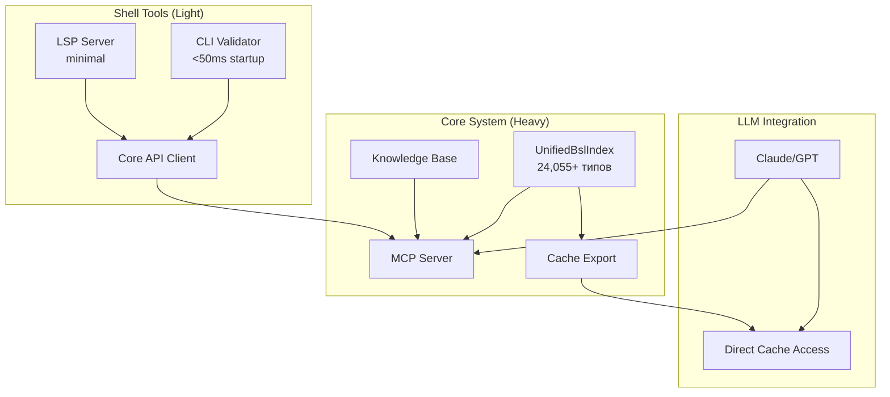

# BSL Type Safety Analyzer - Development Roadmap

**Версия:** v1.0.0  
**Статус:** 🎯 **Unified Concept - Dual-Layer Architecture**  
**Дата обновления:** 2025-08-01

## 🏗️ Архитектура системы



## 📊 Текущее состояние системы

### ✅ Core System - Завершенные компоненты

| Компонент | Описание | Метрики |
|-----------|----------|---------|
| **UnifiedBslIndex** | Единый индекс платформы и конфигурации | 24,055+ типов, O(1) поиск |
| **Platform Cache** | Версионное кеширование платформы | 4,916 типов, 588ms загрузка |
| **Configuration Parser** | Прямой парсинг XML объектов | Поддержка всех объектов |
| **Type System** | Граф наследования и совместимости | 100% покрытие |

### ✅ Core System - Недавно завершенные компоненты

| Компонент | Описание | Дата завершения |
|-----------|----------|-----------------|
| **Form Integration** | ConfigurationXmlParser расширен для парсинга форм как BslEntity | 2025-08-01 |
| **UnifiedBslIndex** | Теперь включает полную информацию о формах (команды, элементы) | 2025-08-01 |

### 🚧 В разработке

| Компонент | Слой | Статус | Приоритет | Срок |
|-----------|------|--------|-----------|------|
| **MCP Server** | Core | 📝 Дизайн готов (5%) | 🔴 Критический | 2 недели |
| **Cache Export** | Core | 🆕 Планируется | 🔴 Критический | 1 неделя |
| **BSL Parser** | Shell | ❌ Блокер (10%) | 🔴 Критический | 2 недели |
| **CLI Validator** | Shell | 🆕 Планируется | 🔴 Критический | 1 неделя |
| **Core API** | Shell | 🆕 Планируется | 🔴 Критический | 1 неделя |
| **Knowledge Base** | Core | 🆕 Планируется | 🟡 Средний | 3 недели |
| **LSP Server** | Shell | 🚧 Базовая структура (20%) | 🟡 Средний | 2 недели |

## 🎯 Цели проекта

### Первичная цель (LLM Support)
Обеспечить LLM полным контекстом для генерации корректного кода 1С без ручного вмешательства

### Вторичная цель (Developer Tools)
Предоставить разработчикам быстрые инструменты валидации с минимальным footprint

## 📈 План развития

### Фаза 1: Core Foundation (8 недель)

```
Недели 1-2:  MCP Server
            └─ Rust + tokio реализация
            └─ 4 базовых инструмента
            └─ Интеграция с UnifiedBslIndex

Неделя 3:    Form Integration (НОВОЕ!)
            └─ ✅ Адаптер FormContract → BslEntity
            └─ ✅ Базовая информация о формах в индексе  
            └─ ✅ Тесты интеграции
            
Неделя 4:    Cache Export Engine  
            └─ SQLite с индексами
            └─ MessagePack бинарный формат
            └─ JSON универсальный

Недели 5-6:  Knowledge Base
            └─ Сбор паттернов
            └─ Примеры использования
            └─ Контекстная информация

Недели 7-8:  Docker & Deployment
            └─ Docker compose
            └─ Systemd сервис
            └─ CI/CD pipeline
```

### Фаза 2: Shell Development (4 недели)

```
Недели 1-2:  BSL Grammar (tree-sitter)
            └─ Портирование грамматики
            └─ Инкрементальный парсинг
            └─ Error recovery

Неделя 3:    CLI Validator + Core API
            └─ Минимальный парсер
            └─ HTTP/IPC клиент
            └─ Offline кеш

Неделя 4:    LSP Integration
            └─ Подключение к Core
            └─ Базовая диагностика
```

### Фаза 3: Integration & Polish (2 недели)

```
Неделя 1:    Packaging & Distribution
            └─ Core installer
            └─ Shell в cargo/npm
            └─ Brew/apt пакеты

Неделя 2:    Testing & Documentation
            └─ E2E тесты
            └─ Performance benchmarks
            └─ Видео туториалы
```

## 📊 Ключевые метрики

### Core System (LLM-focused)
- ✅ **Полнота:** 100% типов платформы и конфигурации
- 🎯 **Latency:** < 10ms на MCP запрос
- 🎯 **Export:** < 5 сек для всех форматов
- 🎯 **Uptime:** 99.9%

### Shell Tools (Developer-focused)
- 🎯 **Startup:** < 50ms холодный старт
- 🎯 **Memory:** < 10MB idle, < 50MB active
- 🎯 **Validation:** < 100ms на файл
- 🎯 **Offline:** > 80% точность

### Общие показатели
- 🎯 **LLM accuracy:** > 90% корректной генерации
- 🎯 **Developer satisfaction:** > 4.5/5
- 🎯 **Community:** 100+ активных пользователей

## 🚀 Быстрый старт после реализации

### Для LLM (Core)
```bash
# Запуск Core сервера
bsl-analyzer server --port 7777

# Экспорт кеша для прямого доступа
bsl-analyzer export-cache --format sqlite --output cache.db

# MCP интеграция
export MCP_SERVER_BSL="http://localhost:7777"
```

### Для разработчиков (Shell)
```bash
# Быстрая валидация
bsl-analyzer check Module.bsl

# С подключением к Core
bsl-analyzer check Module.bsl --core http://localhost:7777

# Offline режим
bsl-analyzer check Module.bsl --offline
```

## 🔧 Технологический стек

### Core System
- **Язык:** Rust (производительность + безопасность)
- **Async:** tokio (для MCP сервера)
- **Storage:** SQLite + MessagePack
- **Protocol:** MCP (Model Context Protocol)

### Shell Tools  
- **Parser:** tree-sitter (инкрементальность)
- **CLI:** clap + colored output
- **Client:** reqwest/hyper
- **Cache:** sled/rocksdb

## 📋 Известные проблемы и решения

### 🔴 Критические проблемы

#### FormXmlParser vs ConfigurationXmlParser ✅ РЕШЕНО
**Решение реализовано (2025-08-01):**
- ConfigurationXmlParser расширен методом `parse_form_xml()`
- Формы парсятся как полноценные BslEntity
- Команды формы становятся методами в interface.methods
- Элементы формы сохраняются в extended_data
- Поддержка обеих структур: Forms/Name/Form.xml и Forms/Name/Ext/Form.xml

**Результат:**
- ✅ Формы полностью интегрированы в UnifiedBslIndex
- ✅ Единое представление всех типов через BslEntity
- ✅ FormXmlParser остается для специализированного UI анализа в Shell

### 🟡 Некритические проблемы

#### Legacy компоненты
- **MetadataReportParser** - оставить для совместимости с текстовыми отчетами
- **HybridStorage** - заменен на UnifiedBslIndex, но код остается для истории

## 🎉 Итоговое видение

**BSL Type Safety Analyzer v1.0** - это двухуровневая система, где:
- **Core** обеспечивает LLM полным контекстом для качественной генерации
- **Shell** дает разработчикам быстрые инструменты валидации

Это позволяет получить лучшее из двух миров без компромиссов.

---

**Следующий шаг:** Начать реализацию MCP Server (Фаза 1, недели 1-2)